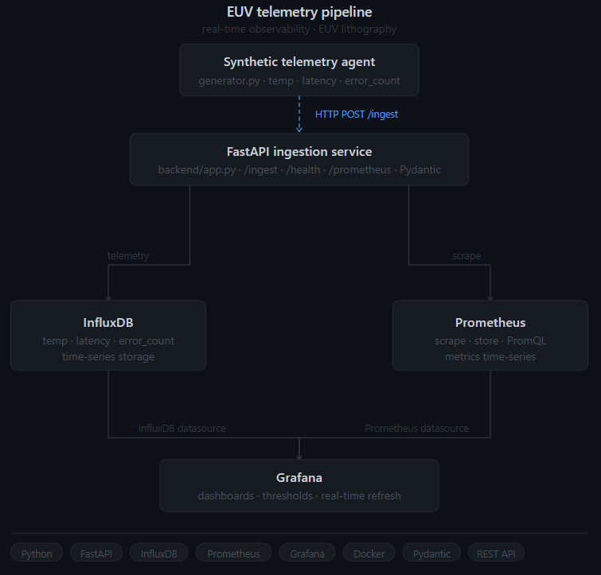
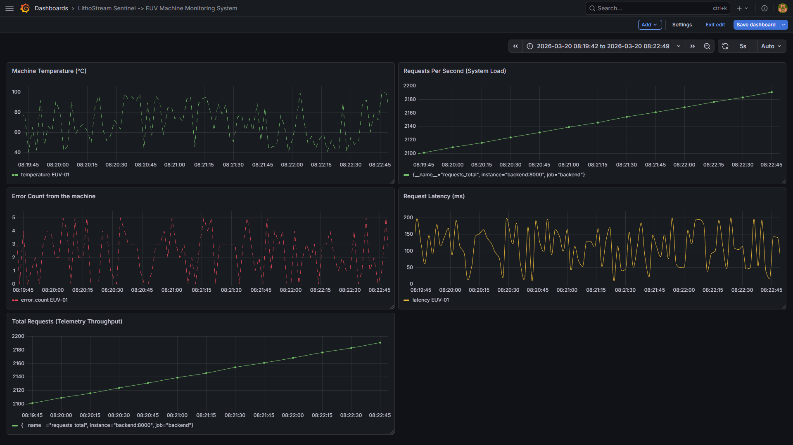
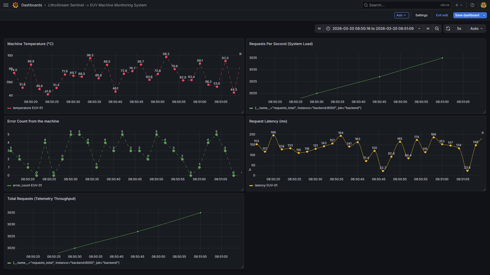
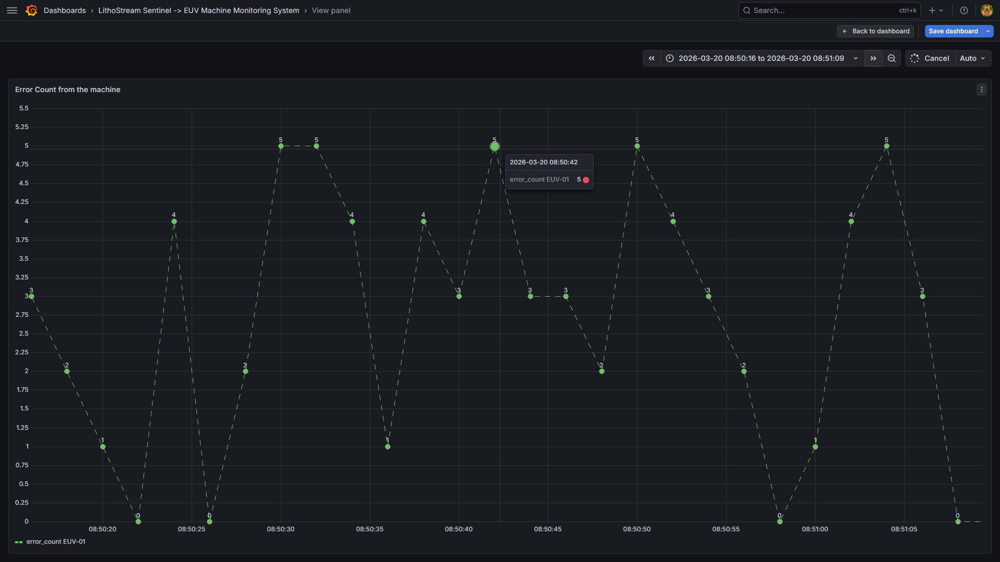
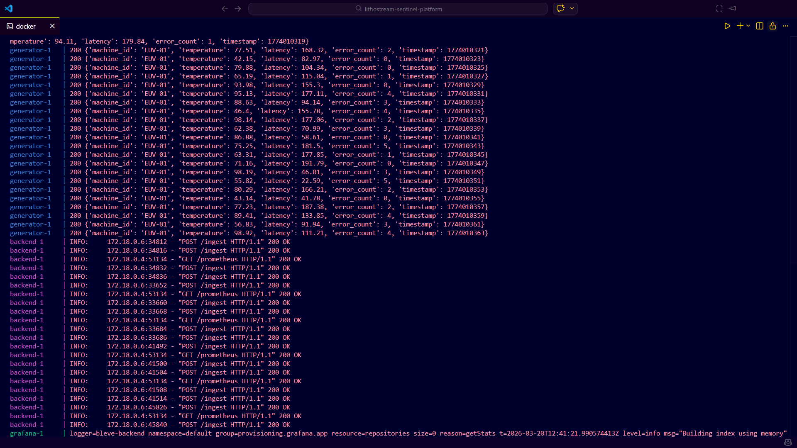
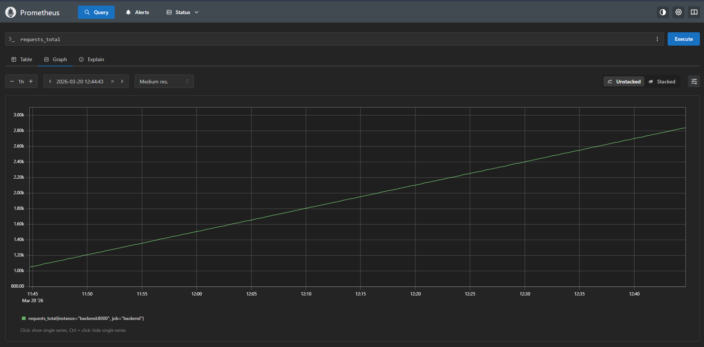

# LithoStream Sentinel - Real Time Machine Monitoring System

A production-style observability platform that simulates industrial machine telemetry, ingests high-frequency signals, and visualizes system behavior in real time using Grafana dashboards.


## Problem

Modern industrial systems (e.g., semiconductor machines, manufacturing equipment) generate continuous streams of telemetry data such as temperature, latency, and error signals.

However, many systems lack:

* real-time visibility
* unified monitoring of system + machine signals
* early indicators of failure


## Solution

LithoStream Sentinel is a real-time telemetry monitoring platform that:

* simulates machine data streams
* ingests telemetry through a FastAPI service
* stores time-series data in InfluxDB
* tracks system metrics using Prometheus
* visualizes everything in Grafana dashboards


## Software Architecture



### Flow Explanation

1. Generator simulates machine telemetry (temperature, latency, errors)
2. FastAPI ingestion service validates and processes incoming data
3. Telemetry is written to InfluxDB (time-series storage)
4. Prometheus scrapes system metrics from FastAPI
5. Grafana visualizes both:

   * system metrics (Prometheus)
   * machine telemetry (InfluxDB)


## Features

* Real-time telemetry ingestion
* Schema validation using Pydantic
* Time-series storage with InfluxDB
* System monitoring with Prometheus
* Live dashboards with Grafana
* Threshold-based alert visualization
* Auto-refreshing real-time UI


## Tech Stack

* **Backend:** FastAPI (Python)
* **Time-Series DB:** InfluxDB
* **Monitoring:** Prometheus
* **Visualization:** Grafana
* **Containerization:** Docker, Docker Compose


## Screenshots

### Dashboard






### Backend Logs (Live Ingestion)




### Prometheus Metrics




## Setup & Run

### 1. Clone the repo

```
git clone https://github.com/harsha-venkateshwara/lithostream-sentinel-platform.git
cd lithostream-sentinel-platform
```

### 2. Run the system

```
docker compose up --build
```


### 3. Access services

CURRENTLY WORKING ON DEPLOYMENT PART. The Results attached are from running the modules locally.


## API Endpoint

### POST /ingest

Sample payload:

```json
{
  "machine_id": "EUV-01",
  "temparature": 82.5,
  "latency": 120.4,
  "error_count": 2,
  "timestamp": 1700000000
}
```

## Key Learnings

* Built a distributed real-time data pipeline
* Implemented observability using Prometheus + Grafana
* Designed time-series storage with InfluxDB
* Debugged container networking and service communication
* Structured system using microservice-style architecture


## Future Improvements

* ML-based anomaly detection
* Alerting system (Grafana alerts)
* Kafka-based streaming pipeline
* Root cause analysis engine
* Kubernetes deployment


## Why This Project Stands Out

* Combines **backend + data + infra + visualization**
* Demonstrates **real-world observability patterns**
* Mimics **production monitoring systems used in industry**
* Shows strong understanding of **distributed systems**


## Author

**Harsha Venkateshwara**
MS Computer Science & Engineering (AI/ML) — University at Buffalo


## Tech Stack
Python, FastAPI, InfluxDB, Prometheus, Grafana, Docker, Kubernetes


## Endpoints
/health
/ingest
/prometheus